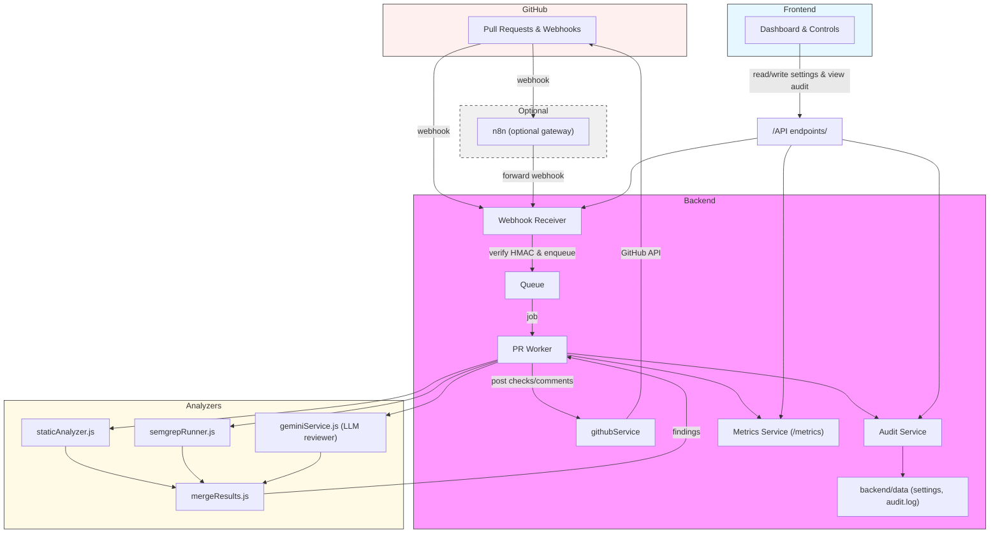

# PRSense — AI-Powered Code Review Assistant


---

## Project overview

PRSense is an AI-assisted code-review system that integrates with GitHub (or GitLab) to provide automated pull request reviews. It combines lightweight heuristic static checks, Semgrep scans (when available), and an LLM-based semantic reviewer to generate actionable findings and optionally post inline review comments and check runs on PRs.

This README documents production deployment, required configuration, security notes, observability, and operational guidance.

---

## Key features

- Receive GitHub webhooks and queue PR review jobs.
- Run static heuristic checks and Semgrep (if installed) on changed hunks.
- Run semantic review using an LLM (Gemini integration present) and merge results.
- Post a Check Run summary and optionally inline comments on PRs.
- Per-repo/global settings to control auto-posting and thresholds.
- Lightweight audit log (`backend/data/audit.log`) and Prometheus metrics (`/metrics`).
- Optional n8n workflow included to buffer and retry webhooks before forwarding to the backend.

---

## Repository layout

- `backend/` — Node.js Express backend (CommonJS)
  - `src/` — source files
  - `data/` — persistent data (settings, audit log) (created at runtime)
  - `Dockerfile` — container image for backend
- `frontend/` — React + Vite UI (ESM)
- `integrations/n8n/` — starter n8n workflow + README
- `docker-compose.yml` — quick demo composition (backend + n8n)

---

## Architecture Diagram

Below is the complete architecture diagram for PRSense. It shows the optional n8n gateway, the webhook receiver, queue/worker, analyzer components (heuristic static checks, Semgrep, LLM/Gemini), merge/posting flow, observability, and the frontend.



## Prerequisites

- Node.js 18+ (for local dev)
- npm
- Optional: Redis for BullMQ (recommended for production)
- Optional: Semgrep installed on the host (or in image) to enable Semgrep-based scans
- Docker & docker-compose (for containerized demo)

---

## Environment variables (required / recommended)

Set these for the backend (examples use a `.env` file in `backend/`):

Required for GitHub App mode (recommended):

- `GITHUB_APP_ID` — GitHub App numeric ID.
- `GITHUB_PRIVATE_KEY_PATH` — Path to the private key PEM file for the GitHub App (PEM file on disk).
- `GITHUB_WEBHOOK_SECRET` — Shared secret used by GitHub webhook payload signatures (HMAC SHA256).

Optional and useful in production:

- `GITHUB_TOKEN` — fallback personal access token (used if App token exchange fails).
- `ADMIN_SECRET` — secret header required to update settings via `POST /api/settings` in production.
- `REDIS_URL` — `redis://host:6379` to enable BullMQ queue (if installed). If not provided, the in-process queue is used.
- `PRSENSE_BACKEND_URL` — used by the n8n workflow as the forwarding target (default `http://localhost:3001`).
- `PORT` — backend port (default `3001`).
- `NODE_ENV` — `production` or `development`.
- `FRONTEND_URL` — used for CORS in dev (default `http://localhost:5173`).

Frontend environment (for local dev; place in frontend `.env` or `vite` build env):

- `VITE_API_BASE_URL` — API base (default `http://localhost:3001`).

Secrets handling
- Store secrets (private key, webhook secret, admin secret) securely — e.g., environment variables in a secrets manager (AWS Secrets Manager, Vault) or CI/CD secret store. Do not commit secrets to git.

---

## Setting up GitHub App (high-level)

1. Create a new GitHub App in your GitHub organization or user settings.
2. Required permissions for the App (minimal recommended):
   - Pull requests: Read & write (to post comments and check runs)
   - Contents: Read (to fetch file blobs when needed)
   - Checks: Read & write
3. Webhook: set the Webhook URL (if using n8n, point GitHub to n8n webhook; otherwise directly to `https://<host>/api/webhooks/github`) and set the Webhook secret — use `GITHUB_WEBHOOK_SECRET`.
4. Generate & download the private key and store it securely. Put the path in `GITHUB_PRIVATE_KEY_PATH`.
5. Note the GitHub App ID and set `GITHUB_APP_ID`.
6. Install the App on the target repository (or organization) and grant repository access.

Detailed steps and screenshots are out of scope — follow GitHub's official docs for creating and installing a GitHub App.

---

## Quickstart — Local development

1. Backend

```bash
cd backend
npm install
# create a .env file in backend/ with required values (see Environment variables)
npm run dev
```

2. Frontend

```bash
cd frontend
npm install
npm run dev
```

3. (Optional) n8n — import workflow

- Start n8n (desktop or docker) and import `integrations/n8n/prsense-github-webhook-workflow.json`.
- Configure environment variable `PRSENSE_BACKEND_URL` in n8n to point to your backend if different.

4. Test flow

- Configure GitHub webhook to point to n8n webhook (or backend directly) and set the same webhook secret.
- Open a PR in the test repo and monitor backend logs. The PR should be enqueued, analyzed, and a Check run (and inline comments if auto-post enabled) created.

---

## Production deployment (recommended checklist)

1. Use a process manager or container orchestration (Docker Compose, Kubernetes).
2. Use Redis for durable queues and set `REDIS_URL`.
3. Ensure `GITHUB_PRIVATE_KEY_PATH` is mounted securely (or use environment-provided key handling).
4. Use secure secrets management for `GITHUB_WEBHOOK_SECRET`, `ADMIN_SECRET`, and other tokens.
5. Use a persistent storage for audit (file becomes unwieldy) — e.g., Postgres or S3 + structured logs.
6. Add metrics scraping (Prometheus) for `/metrics`.
7. Add centralized logging and alerting.

Example: Docker Compose (demo)

```bash
docker compose up --build
```

This will run the backend on port `3001` and an n8n instance on `5678` (see `docker-compose.yml`). Adjust secrets and volumes for production.

---

## API endpoints (selected)

- `POST /api/webhooks/github` — GitHub webhook receiver (expects raw JSON body and `x-hub-signature-256`).
- `POST /api/analyze-pr` — On-demand PR analysis (used by frontend analyzer UI).
- `POST /api/analyze-repo` — On-demand repository analysis.
- `POST /api/analyze-code` — Local code analysis endpoint.
- `GET /metrics` — Prometheus metrics.
- `GET /api/settings` — Read current settings.
- `POST /api/settings` — Update settings (requires `x-admin-secret` header if `ADMIN_SECRET` is set).
- `GET /api/audit` — List recent audit events.

Use the React frontend or `curl` to interact with these endpoints:

```bash
# read settings
curl http://localhost:3001/api/settings

# update settings (dev)
curl -X POST http://localhost:3001/api/settings -H "Content-Type: application/json" -d '{"autoPostComments":false,"commentThreshold":60}'

# get audit events
curl http://localhost:3001/api/audit

# metrics (Prometheus format)
curl http://localhost:3001/metrics
```

---

## Observability & audit

- Audit log: `backend/data/audit.log` — newline-delimited JSON entries for incoming webhooks and proposed/posted comments. For production, migrate to a DB or logging service.
- Metrics: Prometheus via `prom-client` at `/metrics`.
- Logs: backend writes to stdout/stderr; integrate with a centralized logger (ELK/CloudWatch) in production.

---

## Security and operational notes

- Protect `POST /api/settings` with `ADMIN_SECRET` to avoid unauthorized setting changes.
- Do not commit `GITHUB_PRIVATE_KEY_PATH`, `GITHUB_WEBHOOK_SECRET`, `GITHUB_TOKEN`, or `ADMIN_SECRET` to source control.
- Use least-privilege for the GitHub App. Only request permissions you need (PRs, checks, contents).
- Rate limiting: backend has basic rate limiting middleware. Monitor GitHub API rate limits and implement exponential backoff for API calls if needed.
- Inline comment posting uses diff `position` derived from patches; when GitHub omits patches, comment placement may require further handling (GraphQL review APIs or posting on issue thread).

---

## Testing and CI recommendations

- Add E2E tests that replay sample GitHub webhook payloads (store fixtures in `tests/fixtures`) and assert:
  - PR job enqueued and processed
  - Check run posted (mock GitHub API or run against a disposable test repo)
  - Inline comments posted or proposed in audit
- Add unit tests for `mergeResults`, static analyzers, and patch utils.
- Add build & deployment pipelines that run tests, build Docker images, and deploy to staging first.

---

## FAQ / Troubleshooting

- Semgrep not running? Install `semgrep` (pip or npm `npx semgrep`) on host or include in the container image.
- Comments failing to post (403/401)? Check GitHub App installation permissions and `githubAppAuth` token exchange logs. Verify the App is installed into the repository.
- No webhook events received? Verify GitHub webhook delivery logs and ensure the webhook secret matches `GITHUB_WEBHOOK_SECRET`.
- Want to disable auto-posting temporarily? Use frontend toggle or run `POST /api/settings` to set `autoPostComments=false`.

---

## Contributing

Contributions are welcome. Please open issues or PRs against the repository. Follow the project's coding style and add tests for new features.

---

## Contact

For questions during deployment or demos, contact the original authors listed in the repository.
# PRSense

PRSense is a production-grade, AI-powered code review SaaS that combines instant browser-side static analysis with Gemini-backed semantic review. It is built as a two-layer pipeline:

- Static Engine: fast regex and heuristic checks that run in the browser and surface known dangerous patterns immediately.
- AI Analysis: a backend Gemini flow that looks for logic flaws, architecture issues, and deeper review context.

## Stack

- Frontend: React 18, Vite, React Router, Zustand, Framer Motion, Monaco Editor, React Three Fiber, Tailwind CSS
- Backend: Express, Gemini API, Joi validation, Helmet, Morgan, CORS, rate limiting

## Project Structure

- `frontend/` contains the dashboard, landing page, results UI, static analysis engine, and shared design system.
- `backend/` contains the Gemini API service and review endpoints.

## Setup

1. Install dependencies in both apps:

```bash
cd backend && npm install
cd ../frontend && npm install
```

2. Configure environment variables:

- `backend/.env`:

```bash
GEMINI_API_KEY=your_key_here
PORT=3001
FRONTEND_URL=http://localhost:5173
NODE_ENV=development
```

- `frontend/.env`:

```bash
VITE_API_BASE_URL=http://localhost:3001
```

3. Start the backend:

```bash
cd backend
npm run dev
```

4. Start the frontend:

```bash
cd frontend
npm run dev
```

## What PRSense Does

- Runs 25+ browser-side static rules in about 50ms.
- Starts Gemini analysis in parallel so the UI never waits for AI before showing feedback.
- Deduplicates overlapping findings and merges them into one review card when both engines catch the same issue.
- Surfaces a score, summary, categorized issues, and explain-fix guidance.
- Lets you choose a language, paste or upload code, and switch between Deep Review and Explain Code modes.
- Persists analysis state in session storage so the dashboard and results stay available after a refresh in the same session.

## Backend Endpoints

- `POST /api/analyze-code` - returns Gemini analysis for submitted code.
- `POST /api/explain-fix` - returns a plain-English fix explanation for a selected issue.
- `GET /health` - health check.

## Notes

- If `GEMINI_API_KEY` is missing, the backend falls back to a deterministic semantic analysis mode so the app remains usable during development.
- The frontend static engine does not depend on external packages and runs entirely in the browser.
- The results page will redirect back to the dashboard if there is no merged analysis in state.
